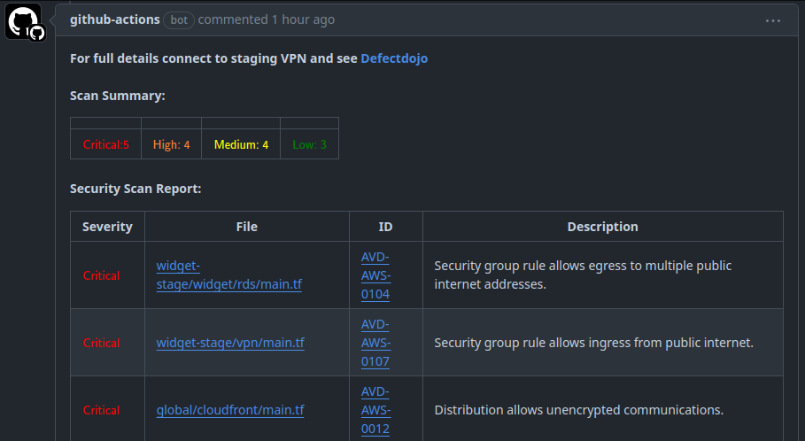

# GitHub Action - Security Scanner and Reporter


[](https://opensource.org/licenses/MIT)



## Table of Contents

- [Usage](#usage)
- [Features](#features)

## Usage

### Action Setup

```yaml
name: Security Scan PR

on: 
  pull_request:
    types: [opened, ready_for_review, reopened]

jobs:
  security-scan-pr:
    name: Security Scan PR
    runs-on: ubuntu-latest
    steps:
      - name: Checkout code
        uses: actions/checkout@v4
      - name: Run Scans and Comment on PR
        uses: FollowUpBoss/security-action@main
        with:
          token: ${{ secrets.GITHUB_TOKEN }}
```

## Features
Action uses [Trivy](https://trivy.dev) to perform scanning. Currently it is configured:
- Run Misconfiguration scanning against Infrastructure as Code
- Output the scan in json format
- Parse and validate scan output
- Generate or Update a PR comment
